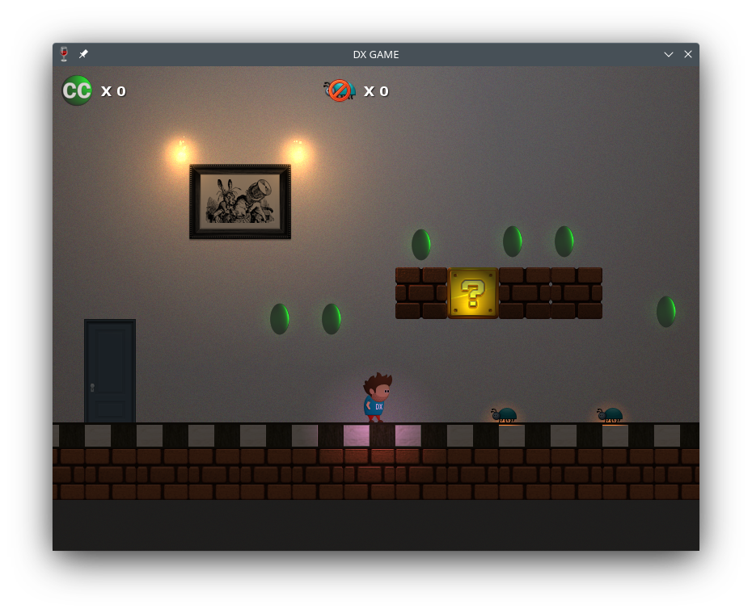

# DxGame

DxGame - это Mario-подобный платформер который раскроет перед игроком тернистый путь молодого джуна на пути к заветной цели - стать крутым разработчиком в одной известной компании образца 2012 года.

Игра создана ребятами из Visualizaion Team тёплыми ламповыми предновогодними вечерами в декабре 2011 года в качестве новогоднего подарка для всех коллег: настоящих, бывших и будущих. Полна отсылок, мемов и намеков. Всем кто что-либо узнает - большущий привет!

В качестве движка игры использован [Ethanon engine](https://github.com/asantee/ethanon).

## Управление

<kbd>Alt</kbd> + <kbd>⏎</kbd> - полноэкранный режим

<kbd>Esc</kbd> - выход

<kbd>⇦</kbd> - движение влево

<kbd>⇨</kbd> - движение вправо

<kbd>␣</kbd> - прыжок

<kbd>S</kbd> - ускорение (влияет на прыжок)

<kbd>Ctrl</kbd> - стрельба (доступна после получения DxHelmet)

## Уровни

### 7 Этаж (1 уровень)

* Необходимо собрать **20** C#
* Пофиксить **10** багов

На этом уровне неопытному DxHero предстоит совершенствовать свои навыки в написании совершенного кода на языке C#, и попутно фиксить баги. В случае неудачи герой отправится перечитывать Совершенный Код.

На этом уровне DxHero первый раз встретит артефакт Шляпа Ильича, который даст возможность герою избежать одну ошибку.

### 8 Этаж (2 уровень)

* Необходимо собрать **20** удачных сборок CCTray
* Пофиксить **15** багов

Научившись писать код и фиксить баги, наш DxHero знакомится с CI/CD. Ведь мало просто написать фичу или пофиксить баг, его еще надо заложить в систему контроля версий и ничего при этом не сломать! На этом уровне герой встретит первого босса - CcMan, который, в случае оплошности DxHero, сделает роллбэк его коммиту.

**Примечание:** Дима, спасибо тебе за всё то чему ты нас научил, ты был настоящим профессионалом. Жаль что ты так рано нас покинул.

### 9 Этаж (3 уровень)

* Необходимо ответить на **25** пользовательских вопросов
* Пофиксить **12** багов

На должном уровне освоив разработку наш DxHero встречает новое испытание - Support Week. Во время этой недели уже опытный разработчик должен помогать саппорту отвечать на пользовательские вопросы, не давая им протухнуть. Это поможет нашему разработчику быть ближе к клиентам. Отвечая на пользовательские вопрсы, герой не должен забывать фиксить баги.

Опасайтесь сложных клиентов, кидающих опасные вопросы!

На этом уровне DxHero первый раз встретит артефакт DxHelmet, который даст возможность герою стрелять.

### 10 Этаж (4 уровень)

* Необходимо разработать **35** фич
* Пофиксить **30** багов
* Ограничение времени **90** секунд

Овладев многими примудростями, DxHero подходит к финальному испытанию и главному боссу. За отведённое время DxHero необходимо разработать новый продукт с обширным функционалом, не забывая при этом фиксить баги в старых продуктах. А так же получить одобрение на новый продукт от главного босса - Falcon'а. 

## Прохождение

[Видео прохождения](https://vk.com/video104996464_456239206)

## Авторы

Александр Кравцов

Александр Ларин

Александр Костик

Алексаей Акимов

Владимир Дробышев

Максим Васин

Михаил Вендин

Ольга Мосейчук

Юрий Шутов